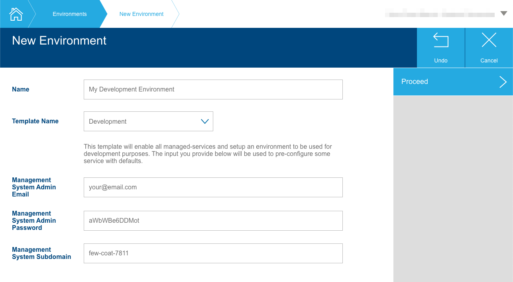
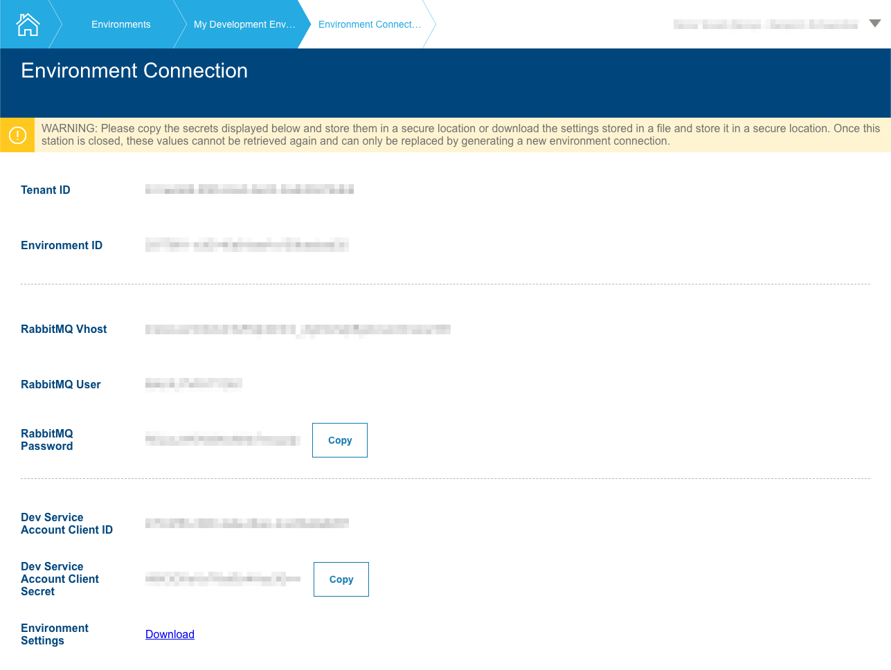

# Mosaic Media Template Solution

## About the Package

This package is part of the Axinom Mosaic development platform. More information
can be found at https://portal.axinom.com/mosaic.

## License

This mono-repo and all packages contained within it are licensed under the MIT
License. Check the LICENSE file for more details.

## Introduction

This repository contains the customizable parts of an Axinom Mosaic solution.
The code included in that repository can be either used as is or customized to
your specific requirements. The Mosaic libraries and services used by that
solution will be provided, updated and maintained by Axinom.

## Prerequisites

Before using the customizable solution make sure that you have the following
software installed:

- [node.js](https://nodejs.org/en/) of version 14.\* needs to be installed.
  - [Version 14.18.2](https://nodejs.org/download/release/v14.18.2/) is
    confirmed to work, where other versions may work as well, but would need to
    be tested
  - To install node.js via a package manager, see
    [node.js documentation](https://nodejs.org/en/download/package-manager/).
- [Yarn](https://classic.yarnpkg.com/en/docs/install)
- [Docker](https://docs.docker.com/engine/install/)

This solution comes with a 'dockerized' infrastructure for local development. It
consists of PostgreSQL and pgAdmin. To start/stop the infrastructure run
`yarn infra:up` and `yarn infra:down` accordingly. See
[Prepare the solution](#prepare-the-solution) section below for additional info
on how to start the development infrastructure.

### Note for Windows users

You need to configure Docker for Windows to use Linux containers, see
[Docker documentation](https://docs.docker.com/docker-for-windows/#switch-between-windows-and-linux-containers).

### Note for Linux users

For a better development experience i.e. being able to run `docker` commands
without `sudo`, please see
[Docker post-installation steps for Linux](https://docs.docker.com/engine/install/linux-postinstall/).

## Prepare and connect the media-template solution

> :warning: This section is describing the steps on how to setup the solution
> for development purpose. If you're interested in how to prepare the services
> for production use please continue reading
> [here](#Package-the-services-for-production-use).

1. Run `yarn` to install all package dependencies for the workspace.
2. Run `yarn apply-templates` to create local copies of all `*.template` files
   in the solution.
3. Run `yarn infra:up` to start the development infrastructure.
4. Run `yarn db:reset` to create the databases for all services in the solution.
5. Set the following parameters in the root `.env` that are specific to your
   development environment:

   - `TENANT_ID`
   - `ENVIRONMENT_ID`
   - `RABBITMQ_VHOST`
   - `RABBITMQ_USER`
   - `RABBITMQ_PASSWORD`
   - `DEV_SERVICE_ACCOUNT_CLIENT_ID`
   - `DEV_SERVICE_ACCOUNT_CLIENT_SECRET`

   You will get these values from the 'Environment Connection' station on the
   Environment Administration Portal. For a description on how to create a new
   environment and getting the required connection values, please follow the
   steps described
   [here](#Prepare-the-developer-environment-and-get-connection-values).

6. Run `yarn setup` to initialize all the services in the solution.

## Run the solution

> :warning: This section is describing the steps on how to run the solution for
> development purpose. If you're interested in how to prepare the services for
> production use please continue reading
> [here](#Package-the-services-for-production-use).

Start the following commands in parallel (in separate terminals):

1. Run `yarn dev:libs` to start the compilation for the `media-messages` package
   in watch mode. Wait until this finishes before proceeding to avoid
   concurrency issues.
2. Run `yarn dev:services` to start the `media-service` & `catalog-service` in
   watch mode.
3. Run `yarn dev:workflows` to start the `media-workflows` in watch mode.
4. Open http://localhost:10053/ in your browser. You should see a grid with
   different workflow options (Movies, Videos, Images, TV shows, Seasons,
   Episodes).

## Run tests

Note that these steps take several minutes to complete.

1. Run `yarn test:reset:dbs` to initialize the testing databases.
2. Run `yarn test` to run the unit tests of the solution.

## Prepare the developer environment and get connection values

Before running the solution you need to create a Mosaic development environment.
In order to do this, go over to https://admin.service.eu.axinom.com and login
using the tenant id, username and password provided to you by Axinom.

After successful login, please select the "Environments" tile and then click the
'+'-Icon to create a new environment.

Provide a user name and select the "Development" template.


The template will automatically create a management user on environment
creation. You can adjust the email and password for that user in the text boxes
below the template selection. By default it will match the email address of your
Environment Administration user.

The 'Management System Subdomain' is the subdomain under which the management
system will be publicly available. For development the management system will
primarily be used from 'localhost', so this value is not too important for now
and is also possible to be changed later still.

After hitting 'Proceed', the environment will be created and the 'Environment
Connection' screen will show up. You can use this screen to retrieve all the
information you need for connecting the media-template solution to the created
environment.



## <a name="productionPackage"></a>Package the services for production use

The steps described above define how to setup and run the services on a local
development machine. In order to run the services on a server the following
procedure should be used.

### Generate a production build and docker image of the backend service

The solution comes with a ready-to-use `Dockerfile` at its root. It requires two
`ARG`s getting passed in:

- `PACKAGE_ROOT` - needs to be set to the relative path of the service that
  should be build. This is usually `services/{serviceName}/service` (e.g.
  `services/media/service`)
- `PACKAGE_BUILD_COMMAND` - needs to be set to the npm command that should be
  used to build the service. THis command needs to be defined on the root
  `package.json`. It is usually `build:{serviceName}-service:prod` (e.g.
  `build:media-service:prod`)

The process will then use the service's `build` script to create a production
build of the service and the `start` script to spin up the server, once the
Docker container starts up.

When running the Docker image, please make sure that you provide the expected
environment variables to the container, as on a production build it will not use
the `.env` files.

### Generate the workflows package

To generate a production build of a workflow package run the following command:

```sh
yarn build:{serviceName}-workflows:prod
```

This script will create a `.tgz` file on the repository root containing the
packaged workflows.

To deploy the workflows into an environment run a command like:

```sh
yarn run pilet publish --no-fresh --url "https://frontends.service.eu.axinom.net/v1/pilets/{tenantId}/{environmentId}" --api-key "{serviceAccountCredentials}" {packageFile}
```

Please note, that you need to provide the 'Base64 Encoded Credentials' of a
service account that has the `Pilets: Publish` permissions as `api-key`. This
value will be shown to you alongside with the other secrets when creating a
service account or when generating new secrets for an existing account.

Also make sure that you define all values the pilet expects to receive inside
the `app.meta.custom` by providing them as additional parameters on this command
like:

```sh
--fields.{key} {value}
```

You can find these keys and values usually in the `.env.template` file of the
workflow.

## Development notes

- `zapatos` models will be generated after `yarn db:commit` but you can trigger
  the generator manually via `yarn internal:zapatos`.
- Run `yarn test:reset:dbs` before running `yarn test` in case new test files
  were created or existing ones renamed or moved.
- To obtain a development-time auth token for a service, run `yarn util:token`
  in that service's workspace. There should also be a corresponding permissions
  file under that service's `scripts/resources`. For a working example see
  `package.json` in the Media Service.
